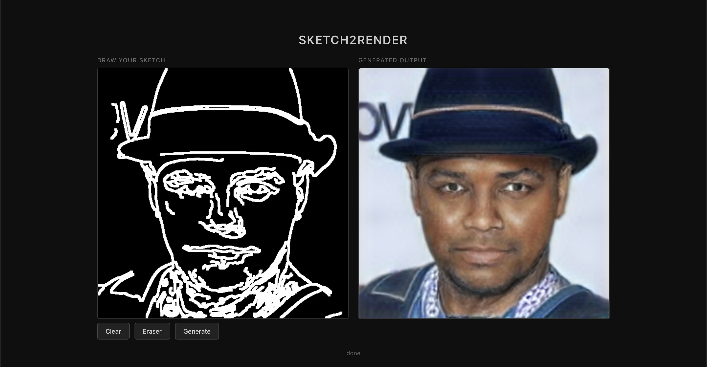
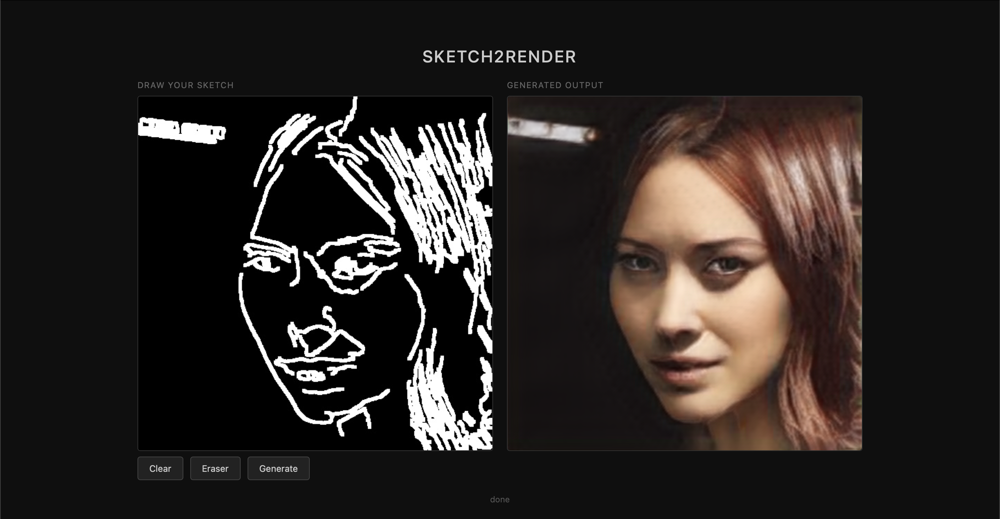
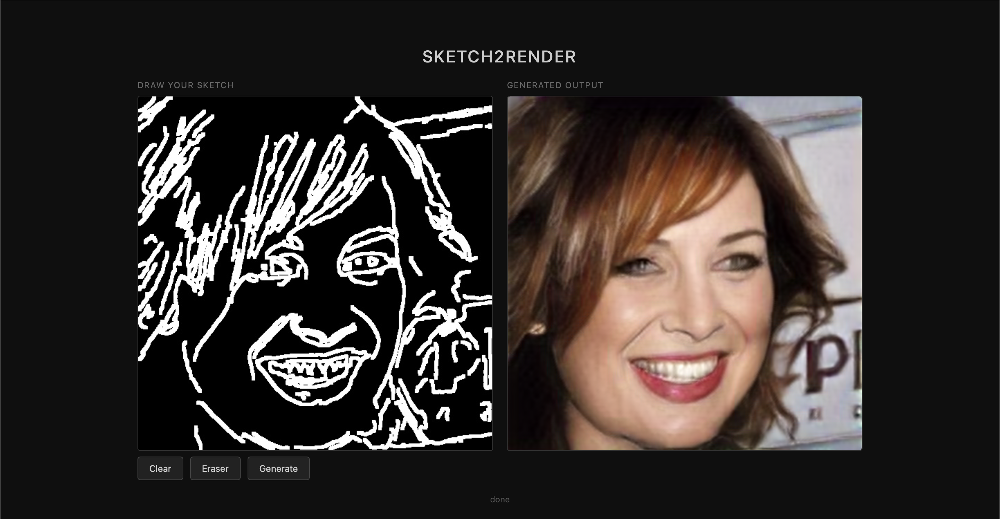
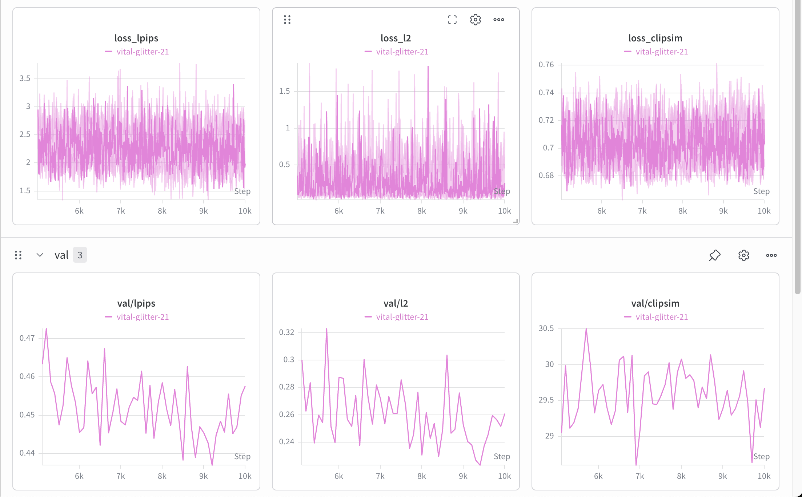

# Sketch2Render

A real-time generative AI microservice that converts hand-drawn face sketches into photorealistic portraits using a fine-tuned Pix2Pix-Turbo model — in a single inference step.

## Demo

Draw on the canvas → click Generate → photorealistic face appears in ~500ms on Apple MPS.




---

## Results

| Metric | Step 0 | Step 3,100 | Direction |
|---|---|---|---|
| val/lpips (perceptual) | 0.75 | 0.50 | ↓ better |
| val/l2 (pixel) | 1.0 | 0.37 | ↓ better |
| val/clipsim (semantic) | 26 | 31 | ↑ better |

### Sample Outputs

> 

> 

> 

---

## Stack

| Layer | Technology |
|---|---|
| Model | img2img-turbo (Pix2Pix-Turbo, fine-tuned) |
| Backend | FastAPI + PyTorch (MPS accelerated) |
| Frontend | HTML5 Canvas |
| Deployment | Docker + Nginx |
| Training | Kaggle T4 x2 GPU, 10,000 steps |
| Dataset | CelebA-HQ (30K pairs) |

## Repository Structure

```
sketch2render/
├── api/
│   ├── main.py             # FastAPI inference server
│   ├── test.py             # API test script
│   ├── requirements.txt
│   └── patch_mps.sh        # Patches .cuda() → .to("mps") for Apple Silicon
├── frontend/
│   └── index.html          # HTML canvas UI
├── pipeline/
│   ├── generate_pairs.py   # OpenCV Canny sketch generation pipeline
│   └── finetune.ipynb      # Kaggle training notebook
├── docker/
│   ├── Dockerfile
│   ├── docker-compose.yml
│   └── nginx.conf
├── checkpoints/            # Model weights (gitignored)
├── environment.yml
└── README.md
```

## Setup

```bash
# create environment
conda env create -f environment.yml
conda activate sketch2render

# clone submodule
git submodule update --init --recursive

# apply MPS patches (Apple Silicon only)
bash api/patch_mps.sh
```

## Running Locally (Recommended for Demo)

```bash
PYTHONPATH=img2img-turbo/src uvicorn api.main:app --reload --port 8000
```

Open `frontend/index.html` in your browser. Draw a face and click **Generate**.


## Running via Docker

```bash
docker-compose -f docker/docker-compose.yml up --build
```

Open `http://localhost:3000`.


## Training

The `pipeline/generate_pairs.py` script generates sketch-photo pairs from any face dataset using OpenCV:

```
Raw Image → Grayscale → CLAHE → Bilateral Filter → Canny Edges → Dilate → 512×512 Pair
```


Training was run on Kaggle T4 x2 for 10,000 steps. Key flags:

```bash
--resolution 512
--train_image_prep no_resize
--learning_rate 1e-5
--checkpointing_steps 500
```

## Key Challenges

**CUDA hardcoded on Apple Silicon** — The img2img-turbo source code hardcoded `.cuda()` throughout. Fixed with `patch_mps.sh` which replaces all CUDA calls with MPS-compatible equivalents at setup time.

**Near-black output after training** — Training at 256×256 caused color channel collapse because SD-Turbo expects 512×512 natively. Retrained at the correct resolution and the issue resolved completely.

**BGR/RGB channel mismatch** — OpenCV (training) uses BGR; PIL (inference) uses RGB. The model learned a BGR→BGR mapping so inference required flipping channels at both input and output.

**Domain gap: Canny vs hand-drawn** — Canny produces thin algorithmic edges; canvas strokes are thick and wobbly. Added `cv2.dilate()` to the training pipeline to thicken edges and bridge the gap.

**Kaggle 12-hour session limit** — Added `accelerator.save_state()` every 500 steps alongside `.pkl` saves, with auto-cleanup of old states to stay under the 20GB disk limit. Resume support added via `--resume_from_checkpoint`.

**Docker MPS passthrough on macOS** — macOS Docker cannot pass through Apple Silicon GPU. Established dual workflow: native terminal for demos (fast), Docker as the deployment vehicle for Linux/cloud.